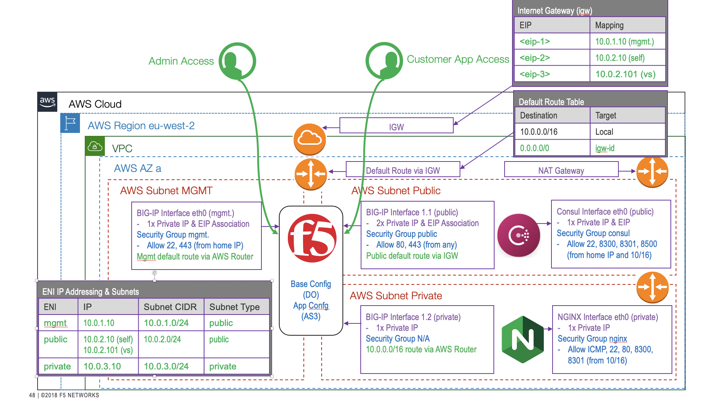

# autows201-start

## This repository is used as the foundation for the Automation 201 Workshop.  It is not functional in the starting state.  Attendees will 'fill in the gaps' during the workshop. 

Before you use this repository, please follow the pre-requisites:

-   Create an AWS IAM for programmatic access, and save the access key and secret key to use in the next step.
-   Install aws cli and run 'aws configure'.  This will create a user credentials file ~/.aws/credentials - Terraform will use these credentials to access your AWS account for automation.

-   If you want to update the filter string, to identify a different AMI for use in this deployment.  You can use the aws cli to test your string... just experiment by changing `*BIGIP-15.1*PAYG-Best*25Mbps*` in the following command, to ensure you get one AMI returned:

    `aws ec2 describe-images --region eu-west-2 --filters "Name=name,Values=*BIGIP-15.1*PAYG-Best*25Mbps*" | grep '\"Name\"\|\"ImageId\"\|\"OwnerId\"'`

This deployment will build the following components:

- AWS infrastructure using the VPC module and other aws_ resources
- An NGINX autoscale group, to provide a simple web app
- Hashicorp Consul for service discovery
- A single BIG-IP with 3 NICs
    - BIG-IP is configured via a user-data script injected on first booot, that performs the following tasks:
        - downloads and installs bigip_runtime_init package
        - provides bigip_runtime_init with its yaml configuration file
        - bigip_runtime_init installs DO, AS3 packages (plus other Automation Toolchain components)
        - bigip_runtime_init declares the DO and AS3 json configurations
    - BIG-IP is reported ready when the NGINX application is available via the Virtual Server.

To deploy the BIG-IP infrastructure, you can:
-   cd ./terraform
-   terraform init
-   terraform plan
-   terraform apply

optionally, you can deploy the FAST (F5 AS3 Templates) declaration (after the BIG-IP infrastructure deployment is complete):
-   cd ../fast
-   terraform init
-   terraform plan
-   terraform apply

To destroy:
-   cd ../fast 
-   terraform destroy
-   cd ../terraform 
-   terraform destroy
